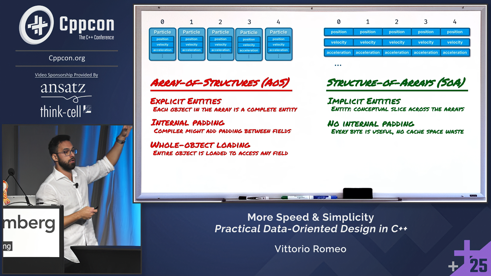

# DODRocketsRaylib

This is a RayLib implementation of my CppCon 2025 keynote demo.

[**More Speed & Simplicity: Practical Data-Oriented Design in C++**](https://www.youtube.com/watch?v=SzjJfKHygaQ)
